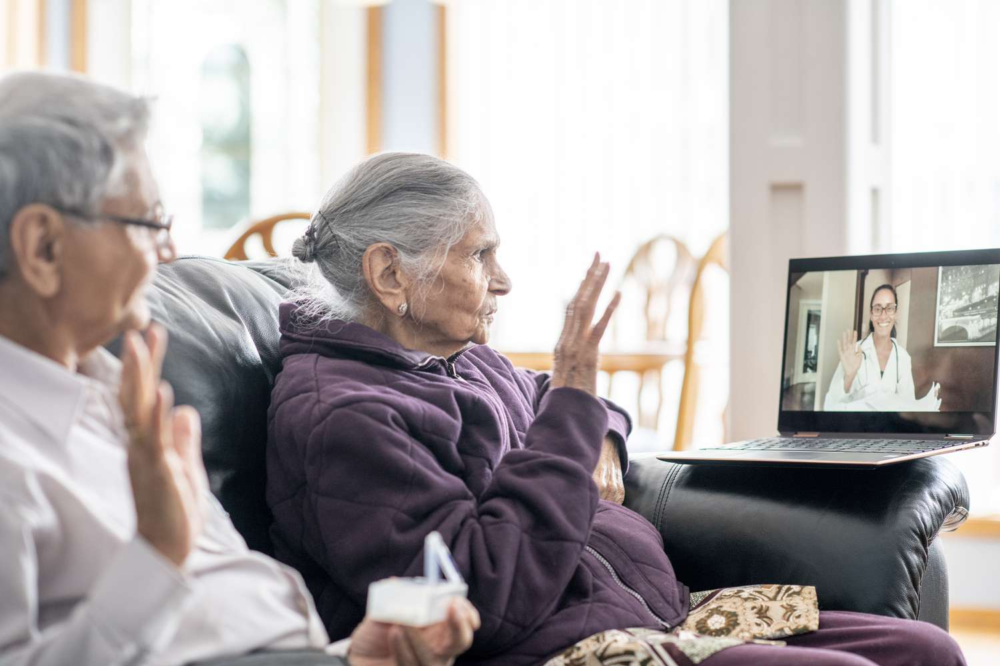
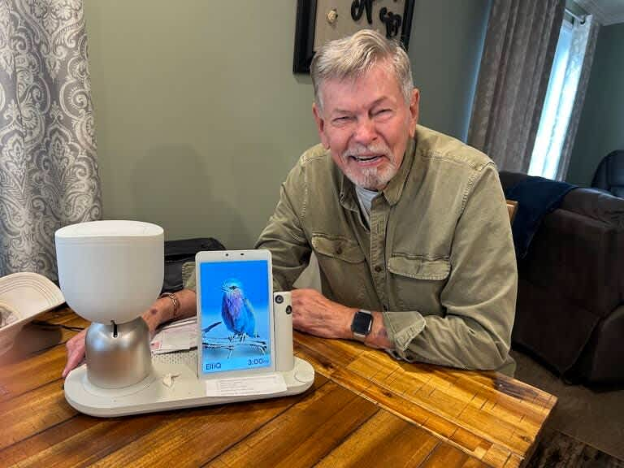

Start Date
End Date
Duration
2026.06.01
2026.06.01
Topic/Title 
Workshop on Intelligent Gerontechnology for Accessible Living
Target Participants & Expected Nos.
Targeted Participants: 
Graduate students and research assistants from Xiaojuan and Xin’s lab, along with other faculty members and students from HKUST and HKUST (GZ). 
We also plan to invite industry partners and external collaborators. Potential candidates are representatives from BNET-TECH (industry) and Tsinghua University (academia)
Other guest speakers from academia, including experts in aging sciences and aging technology. Potential candidates: Prof. Jean Woo (CUHK) and Prof. Bert Shi (HKUST)

Expected Nos.: 50.

Event Webpage
Illustrative images for the event webpage (using remaining Age-Friendly Agents artwork):

<!--
  说明：
  - 下面 3 张图来自 “Designing Age-Friendly Intelligent Agents for Senior People” 事件文件夹中尚未使用的插图
  - 这里只是为网页设计提供参考素材，不会影响正式文案内容
  - 相对路径是从当前 .md 所在目录出发
-->

Other Online Platform(s)
Zoom/Tencent Online Meeting also available for the public audience.
Event Details
(Venue, program rundown, speakers, list of faculty members to be involved. A maximum of 300 words.)

Venue: HKUST
Program Rundown
9:30 – 10:00: Registration and Welcome Introduction 
10:00 – 12:00: Themed Talks and Panel Discussions
Prof Yuntao Wang, Pervasive Human Computer Interaction Lab, Tsinghua University
Prof Jean Woo, Henry G Leong Research Professor of Gerontology and Geriatrics, The CUHK Jockey Club Institute of Ageing
Prof. Bertram Shi, Chair Professor, Director of the Center for Aging Science, The Hong Kong University of Science and Technology
Mr. Richard Leung, CEO of BNET-TECH
Panel Discussion: Panelists jointly discuss the present design paradigms of intelligent (assisted mobility) gerontechnology for senior users.
14:00 – 15:30: Working Group Discussion Session 
Participants break into mixed academic–industry working groups to discuss key themes:
Foundational challenges and opportunities for the next generation gerontechnology
Research agenda for intelligence-augmented gerontechnology
Academia and industry action plans
15:30 – 16:00: Coffee Break
16:00 – 17:00: Working Group Presentation Session
Each group presents its vision of how to move beyond a simple “design recommendation” and define the fundamental research needed to develop and deploy intelligent technologies for accessible living.

Facilitators synthesize insights into future cross-campus initiatives and academia-industry interfaces to create a dynamic, shared ecosystem for both talent and technology in the field of aging and accessibility.
——————————————————————————————————————————————————————————————————————————————————————
###Speakers Bio
##Prof. Yuntao Wang, Pervasive Human Computer Interaction Lab, Tsinghua University
Yuntao Wang’s research focuses on the efficient sensing of behavioral and physiological data, alongside the design of intelligent interactive interfaces for mobile and wearable devices. His work primarily targets: 1) the development of robust and efficient sensing techniques that perform reliably on mainstream mobile and wearable devices, 2) the extraction of meaningful spatiotemporal patterns from multimodal sensory data, leveraging inherent correlations in natural human behaviors to accurately infer user interaction intentions, and 3) the design of novel interaction interfaces that achieve high recognition accuracy and inference efficiency, optimized for deployment on resource-constrained edge devices. He has published over 80 academic papers and received 9 international conference awards. Additionally, he holds 31 granted invention patents. His innovative achievements have been recognized with several prestigious honors, including the Wu Wenjun Artificial Intelligence Outstanding Youth Award (2024), the Young Elite Scientists Sponsorship Program of the China Association for Science and Technology (CAST, 2022), Leading Talent of the High-Level Innovation and Entrepreneurship Program of Qinghai Province (2024), and the First Prize of the China Electronics Institute Science and Technology Award (2019).

##Prof. Jean Woo, Henry G Leong Research Professor of Gerontology and Geriatrics, The CUHK Jockey Club Institute of Ageing
Professor Jean Woo graduated from Cambridge University in 1974. After medical posts in the Charing Cross, Hammersmith, and Brompton Hospitals, she worked in part time posts in general practice as well as research in the University of Hong Kong. She joined the Department of Medicine at the Chinese University of Hong Kong in 1985 as Lecturer responsible for the development of the teaching and service in Geriatric Medicine, becoming Head of the Department in 1993 until 1999, Chief of Service of the Medicine and Geriatric Unit at Shatin Hospital from 1993-2012, and Chair Professor of Medicine in 1994. From 2000-6 she was Head of the Department of Community and Family Medicine, and from 2001-5 Director of the newly established School of Public Health. 

Currently she is Emeritus Professor of Medicine, Henry G Leong Research Professor in Gerontology and Geriatrics, Director of Jockey Club Institute of Ageing and Co-Director of Institute of Health Equity, The Chinese University of Hong Kong. Her research interests include chronic diseases affecting elderly people, health services research, nutrition epidemiology, quality of life issues at the end of life, with over 900 articles in peer-reviewed indexed journals.

##Prof. Bertram Shi, Chair Professor, Director of the Center for Aging Science, HKUST
Prof. Bertram Shi was appointed as Special Advisor to Vice-President for Research and Development (VPRD) with effect from January 1, 2023.

Currently a Professor in the Department of Electronic and Computer Engineering (ECE), Prof. Shi received his PhD in Electrical Engineering from the University of California, Berkeley in 1994 and joined HKUST as Assistant Professor in the same year. He was promoted to Associate Professor in 2001 and then to full Professor in 2008.

Having joined the University in its early years, Prof. Shi has strong administrative experience serving the ECE Department and the School of Engineering. He was Acting Dean of Engineering (2022), Head (2015-2021) and Associate Head (2010-2014) of ECE, and Founding Director of the MSc Program in Electronic Engineering (2004). He has served on various executive committees, notably chairing the Curriculum Committee (2008-2010) during the ramp-up to the launch of the 3+3+4 curriculum. His administrative capability has been demonstrated by his outstanding leadership in successfully driving several endeavors at the Department, School and University levels. 

Prof. Shi is an established scholar in the areas of neuromorphic engineering, computational neuroscience, and human-machine & human-robot interfaces, with a particular focus on the modeling and automated analysis of facial expressions and eye movements. His research group has developed top-ranked systems for emotion recognition and received top paper prizes at international conferences. He was elected a Fellow of the Institute of Electrical and Electronics Engineers (IEEE) in 2001, becoming one of the youngest elected fellows as a testament to his international stature. He has a keen interest in how technology can open doors to a better understanding of human behavior and how to use that understanding to build technology that better supports humanity, which has led to joint research projects with faculty from all four schools of the university.

He has been active in providing professional services to the IEEE and to the academic community at large. He was a Distinguished Lecturer of the IEEE Circuits and Systems Society (CASS), chaired the IEEE CASS Technical Committee on Cellular Neural Networks and Array Computing, and served on the editorial boards of multiple professional journals.  

##Mr. Richard Leung, CEO of BNET-TECH