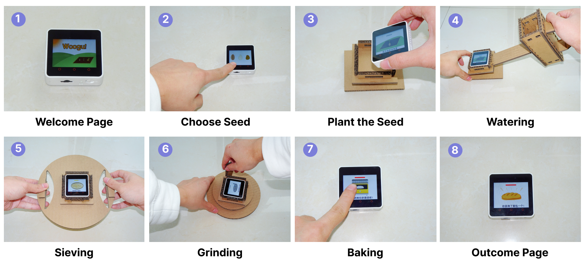
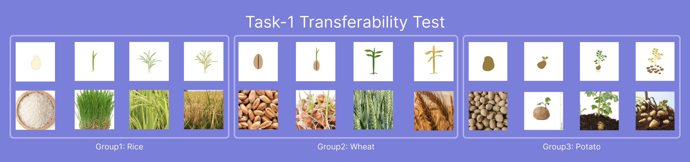
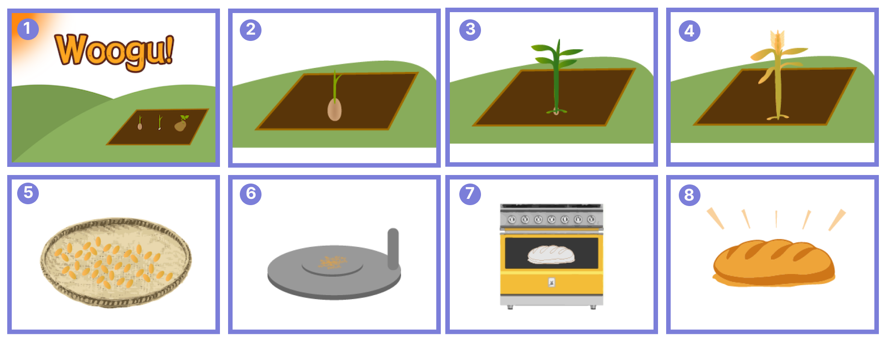
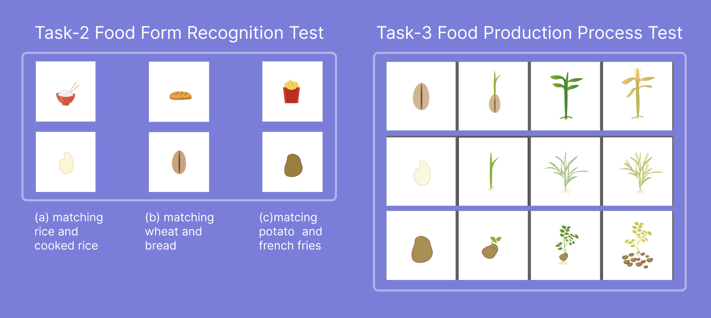

## Page 1

### Text

.
.
Latest updates: hps://dl.acm.org/doi/10.1145/3585088.3593876
.
.
EXTENDED-ABSTRACT
WooGu: Exploring an Embodied Tangible User Interface for Supporting
Children to Learn Farm-to-Table Food Knowledge
HONGNI YE, Duke Kunshan University, Kunshan, Jiangsu, China
.
TONG WU, Duke Kunshan University, Kunshan, Jiangsu, China
.
LAWRENCE H. KIM, Simon Fraser University, Burnaby, BC, Canada
.
MIN FAN, Communication University of China, Beijing, Beijing, China
.
XIN TONG, Duke Kunshan University, Kunshan, Jiangsu, China
.
.
.
Open Access Support provided by:
.
Communication University of China
.
Duke Kunshan University
.
Simon Fraser University
.
PDF Download
3585088.3593876.pdf
08 January 2026
Total Citations: 6
Total Downloads: 465
.
.
Published: 19 June 2023
.
.
Citation in BibTeX format
.
.
IDC '23: Interaction Design and Children
June 19 - 23, 2023
IL, Chicago, USA
.
.
Conference Sponsors:
SIGCHI
IDC '23: Proceedings of the 22nd Annual ACM Interaction Design and Children Conference (June 2023)
hps://doi.org/10.1145/3585088.3593876
ISBN: 9798400701313
.

## Page 2

### Text

WooGu: Exploring an Embodied Tangible User Interface for
Supporting Children to Learn Farm-to-Table Food Knowledge
Hongni Ye∗
Tong Wu∗
zichen.ye@dukekunshan.edu.cn
tong.wu346@dukekunshan.edu.cn
Duke Kunshan University
China
Lawrence H Kim
lawkim@sfu.ca
Simon Fraser University
Canada
Min Fan
mfan@cuc.edu.cn
Communication University of China
China
Xin Tong†
xin.tong@dukekunshan.edu.cn
Duke Kunshan University
China
Figure 1: The user journey of WooGu
ABSTRACT
Food is essential for human health, growth, and development. How-
ever, children need more learning materials and motivation to re-
ceive food literacy education or know the fundamental food pro-
cesses from farm to table. In this work, we explored the design of a
prototype named WooGu with tangible user interfaces (TUI) and
∗Both authors contributed equally.
†Corresponding author
Permission to make digital or hard copies of part or all of this work for personal or
classroom use is granted without fee provided that copies are not made or distributed
for profit or commercial advantage and that copies bear this notice and the full citation
on the first page. Copyrights for third-party components of this work must be honored.
For all other uses, contact the owner/author(s).
IDC ’23, June 19–23, 2023, Chicago, IL, USA
© 2023 Copyright held by the owner/author(s).
ACM ISBN 979-8-4007-0131-3/23/06.
https://doi.org/10.1145/3585088.3593876
embodied interactions, which aims to improve young children’s
food literacy. WooGu presents three design features: a cube dis-
playing user interfaces, step-by-step tasks guiding children to learn
food from farm to table, and hands-on props made by cardboard
empowering embodied interactions. We evaluated WooGu with
two families in a pilot test, and the findings suggested that WooGu
provides children with the embodied experience of food production,
improving their food literacy, logical thinking, and practical ability.
This research contributed to the human-food interaction area and
provided a novel way of learning food literacy for children through
embodied interactions with WooGu.
CCS CONCEPTS
• Human-centered computing →Systems and tools for inter-
action design; User interface toolkits.
681

## Page 3

### Text

IDC ’23, June 19–23, 2023, Chicago, IL, USA
Hongni Ye, Tong Wu, Lawrence H Kim, Min Fan, and Xin Tong
KEYWORDS
Embodied interaction, tangible user interface, prototype design,
food literacy education
ACM Reference Format:
Hongni Ye, Tong Wu, Lawrence H Kim, Min Fan, and Xin Tong. 2023.
WooGu: Exploring an Embodied Tangible User Interface for Supporting
Children to Learn Farm-to-Table Food Knowledge. In Interaction Design and
Children (IDC ’23), June 19–23, 2023, Chicago, IL, USA. ACM, New York, NY,
USA, 7 pages. https://doi.org/10.1145/3585088.3593876
1
INTRODUCTION
Food is essential for human health, growth, and development [17].
Knowing the food processes from farm to table can encourage chil-
dren to make more informed food choices and appreciate the effort
in food production, which also facilitates children’s connection with
the natural world [12]. However, traditional food literacy education
for children primarily focuses on nutrition and lacks an explicit
curriculum, suitable materials, or training to support children in
learning where food comes from and how it is produced and pro-
cessed [15]. Thus, researchers were concerned that food education
might be superficially imparting information to children [7], which
strongly highlights the necessity to explore innovative strategies for
children to gain a better understanding of food literacy, including
various stages in the journey of food from farm to table.
Prior work [9, 10, 13, 23] revealed that tangible user interfaces
(TUI) effectively facilitated children’s learning outcomes by scaf-
folding learning activities, promoting learning behavior, and im-
proving engagement with multi-sensory cues in various scenarios.
Specifically, researchers from Human-Food Interaction (HFI) [3]
field integrate embodied interactions in TUIs to promote social
eating and learning through playful experiences [20]. However, few
studies have investigated that how TUIs can promote children’s
learning of food processes from farm to table. Therefore, we devel-
oped WooGu including an exploratory design process and a pilot
user study. We aim to answer the following research questions
(RQs): (1) How does the WooGu, a TUI prototype including embod-
ied interactions, enhance children’s learning about food processing
from farm to table? (2) To what extent does the WooGu stimulate
positive learning outcomes for children and satisfaction among
parents?
We recruited two families and conducted a pilot user study, and
we also interviewed two parents and three children about their
usability experiences and feedback. Findings suggested that parents
believed WooGu was helpful in acquiring food literacy, and children
showed intense interest in hands-on embodied interactions with
the cardboard props. In summary, our work contributes to the HFI
area by exploring the structure and embodied interactions of a
TUI educational prototype, WooGu. Our design research also offers
design implications in developing future TUIs and HFI research for
children’s food literacy education.
2
RELATED WORK
2.1
Tangible User Interfaces in Children’s
Education
A previous study [10] suggested that tangible user interfaces (TUIs)
improved students’ task performances and learning outcomes be-
cause tangibility offers multi-sensory cues and promotes a more
robust and long-lasting involvement [16]. For example, Fan et al.
designed a TUI prototype to improve children’s (aged 5-7) reading
and writing abilities of Chinese characters through tangible cards
with tactile and kinesthetic sensory feedback cues [5]. Furthermore,
TUI prototypes have also been explored and applied in food literacy
education. For instance, Baurley et al. investigated the embodied in-
teractions of capturing various expressions of recipe authoring [2].
They suggested that embodied interactions informed users with
adequate dimensions, feel, and movement, thus achieving a desired
and memorable dish for users [2].
2.2
Food Literacy and Human-Food Interaction
Food literacy and education research cover nutritional science and
a much broader ground, such as cooking, farming, gardening, agri-
culture, policy, exercise, and mannerisms [7, 19]. In current HFI
and HCI domains, a great number of works focused on the cook-
ing process [2, 11, 14]. For example, RecipeRadio [2] was a TUI
that introduced the recipe-authoring tools for open innovations
in food. It places an emphasis on children’s physical engagement
with cooking tools, creating a space for them to freely experiment
with a variety of culinary methods. So it not only provides chil-
dren with opportunities to unleash their creativity in a simulated
kitchen environment, but also holds immense potential for enhanc-
ing children’s culinary proficiency. However, RecipeRadio did not
contain information about the origins of food. Besides, recent HCI
researchers also explored opportunities in creating playful, social,
and interactive eating food experiences [4, 20–22]. However, prior
work mostly investigated the temporal eating experiences instead
of constructing a food process from farm to table. Therefore, in this
work, we designed a TUI prototype, WooGu, integrating farm-to-
table food knowledge, step-by-step tasks, and hands-on props to
create interactive, embodied, and playful learning experiences.
3
SYSTEM DESIGN AND IMPLEMENTATION
We aim to help children explore and learn farm-to-table food knowl-
edge through a TUI and embodied interactions. We practiced the
following design principles in the exploratory prototyping stage:
• Provide multi-sensory feedback through the TUI. Ac-
cording to prior researchers, TUI can benefit children’s emo-
tional development [18], learning activities [5], and social
skills [6, 8] by providing robust and long-lasting involve-
ment due to multi-sensory coordination. Thus, we utilized
an intelligent cube that integrated visual, audio, and tactile
narratives to provide children with a multi-sensory experi-
ence.
• Deliver the knowledge through embodied interactions.
Embodied learning is most effective for children to translate
knowledge into action and validate their food learning [2].
Therefore, our user journey prioritizes physical interaction
682

## Page 4

### Text

WooGu: TUI for Farm-to-Table Food Education
IDC ’23, June 19–23, 2023, Chicago, IL, USA
between children and cardboard props, creating a playful and
engaging experience that utilizes tangible tools to educate
knowledge about food from farm to table.
3.1
WooGu’s Features
The name of WooGu was named after the Chinese words for "five
grains" (五谷) [1], referring to five traditional grains, i.e., rice, broom
corn millet, grain, wheat, and bean, as well as being a general term
for food. The name of WooGu implies the importance and necessity
for children to learn the process of how food is planted from seeds,
grown into fruits, and finally produced and offered on the table.
3.1.1
The Farm-to-Table Food Knowledge-Guiding Process and Tasks.
Given that children are often removed from the contexts of food
farming and production, they will find difficulties in recognizing
food forms from farm to table. Diet is intertwined with behavior,
morality, and personality. Positive food culture can shape children’s
character and behavior, and vice versa. Therefore, we implemented
the essential steps in WooGu that represents the food production
steps in three steps: seeds-planting and cultivating, processing, and
cooking (see Figure 2). Children will first plant seeds and cultivate
the seeds, (steps 2-4 in Figure 2) and then, they will process the
fruits using tools (i.e., cardboard props) and learn the changes of
food (steps 5-6 in Figure 2). Finally, children will follow the recipes
to understand culinary steps (steps 7-8 in Figure 2). Since we were
at the pilot stage of exploration, we implemented the three most
commonly-eaten starch food: rice, wheat, and potatoes, and pro-
vided cooking recipes for rice, bread, and french fries, accordingly.
3.1.2
The Multi-sensory Feedback from the WooGu Cube. The sec-
ond core design feature of WooGu is the cube with user interfaces
that provide visual, audio, and tactile multi-sensory feedback (see
Figure 1). These visuals show the growing, processing, and cooking
stages of wheat, rice, and potato, helping children understand and
recognize food appearances and their growth and process condi-
tions. The audio information contains instructions and supports
children to better understand the interactions and user tasks. More-
over, WooGu vibrates when children complete their tasks in each
stage to provide them with a sense of accomplishment.
3.1.3
Cardboard Props for Hands-on Experiences. WooGu’s third
design feature is the hands-on cardboard props, which enable chil-
dren to simulate the embodied farming, processing, and cooking
behaviors and actions happened during the three stages. In our
exploratory process, we experimented and designed three hands-
on props using cardboard material, including a watering can, a
siever, and a stone mill (steps 4, 5, and 6 in Figure 1). Children can
place the cube in the holder and use the watering can prop to water
the "plant" (in the cube). The siever prop has two handle-shaped
holes on both sides of the plate that children can hold and shake
the "wheat" in the cube. With the round-shaped stone mill prop,
children can hold the handler and grind the "wheat" into "flour" in
the cube.
3.2
The Technical Solution
The cube is M5Stack Core21, which contains a small screen display,
a speaker, and several interactive sensors. We collected data from
the gyroscope sensor to detect the current movement directions
and acceleration and predict children’s physical interactions with
the hands-on props. Also, by setting different vibrating duration
times with the vibration sensor, we help children differentiate other
interaction conditions such as in-process or task-done. All codes
were written in Python on the UIFlow2 editor.
4
METHOD
4.1
Participats
We recruited three children (2 males and 1 female, aged 6 to 8,
with an average age of 7) and their parents (3 females, ranging
from 35 to 74, with an average age of 48.34) in convenience. All
three children have learned food-related knowledge before through
various means, such as learning from educational toys or games,
verbal teaching, and documentation. Participants voluntarily self-
selected to complete the survey and consented before the study.
We recruited potential participants by sending recruitment posters
to school teachers and parents in the community. Our university’s
IRB approves the study procedure.
4.2
Measurement
We collected data from four sources: a questionnaire for demo-
graphic information, pre/post-study knowledge test for evaluating
learning outcomes, observation and recorded videos for analyzing
users’ behavior, and the semi-structured interview to understand
user experience better.
4.2.1
Food-related Knowledge Test. We administered pre- and post-
food literacy evaluation tasks, including three tasks: (1) the food
image transferability test, (2) the food recognition test, and (3) the
process of food from farm to table test. Task 3 was designed to
investigate children’s mastery of food knowledge from farm to
table. Following interaction with WooGu, a post-study test was
administered with similar testing topics. Results were compared
to investigate learning outcomes, with all test materials in Appen-
dix A.2.
4.2.2
Researchers’ Observations. To understand how children per-
ceive the features of the WooGu and encourage them to explore the
usage of the hands-on props, we displayed the cube and props on a
table. We observed how children interacted with them without our
introduction. Afterward, we encouraged children to think aloud
and observed their facial expressions, body movement, and hand
gestures while playing with WooGu. Researchers took notes and
recorded the entire session with their parent’s permission.
4.2.3
Semi-structured Interviews with Parents and Children. To fur-
ther understand children’s learning outcomes and their parent’s
opinions. We asked children some questions on the following top-
ics during the semi-structured interview: (1) Food Knowledge; (2)
User Experience; (3) Their suggestions and recommendations. After
that, we interviewed their parents on the same topics. We listed the
1M5Stack Core2: https://m5stack.com
2UIFlow: https://m5stack.com/uiflow
683

## Page 5

### Text

IDC ’23, June 19–23, 2023, Chicago, IL, USA
Hongni Ye, Tong Wu, Lawrence H Kim, Min Fan, and Xin Tong
complete interview scripts in the appendix. Two researchers coded
the interview scripts separately using a thematic analysis method.
5
RESULTS
Here, we report children’s and parents’ usability and feasibility
experiences of WooGu and children’s learning outcomes. We also
share design implications summarized from the study results.
5.1
Children’s Learning Outcomes of
Farm-to-Table Food-Related Knowledge
During the pre-test(i.e., the food-related knowledge test), specif-
ically the seed recognition and matching test, all three children
exhibited an 80 percent accuracy rate, suggesting that they could
recognize seed morphology and categories. However, in the third
section of the test which assessed the children’s capacity to explain
the process of making rice, potato, and bread, all three children
achieved only a 20 percent accuracy rate. Interestingly, after fol-
lowing the implementation of WooGu, the children demonstrated a
significant improvement in their food-related knowledge that they
become capable of providing accurate responses to questions about
food knowledge, spanning from farm to table. One of the children
told us in the post-interview,
"Now I know where bread comes from. It is wheat first
and then process it to be flour via siever and stone mill.
Finally, we make it into the dough and bake it in the
oven to cook bread." (P-C1).
In addition, our observations revealed that the children exhib-
ited a keen interest and curiosity in exploring the various props in
WooGu and discovering their functions in the context of food plant-
ing and processing. Notably, the children enjoyed the hands-on
embodied interactions with the cardboard props, and successfully
identified how to use the watering can without explicit instruc-
tions. However, the children appeared to be less familiar with other
farming tools, such as the siever prop and the stone mill prop. One
parent reported that she had previously taken her child to a farm
and demonstrated the use of these tools, but her child still did not re-
tain this information. However, after their interaction with WooGu,
she noted that her child could explain both the apperance and using
method of different props. Furthermore, all three children were
motivated to explore and utilize the various farming props with
WooGu and displayed enthusiasm upon completing the assigned
tasks. For instance,
"I have watched short videos about sievers and stone
mills on TikTok before, but I never used them in my
life. Nevertheless, now I know how to use them, and
producing food is truly complicated." (P-C2)
His parent (P-P1) also commented that WooGu taught children
the series of steps from wheat to bread, and now her child started to
think more about other food’s farming, processing, and production
stages.
5.2
Parents’ and Children’s attitudes towards
playing with WooGu
In the post-interview, all three parents expressed that they liked the
idea of using TUI to motivate their children to learn farm-to-table
food knowledge. For instance, one parent reported,
"I think educating [children] the process of food from
farm to table is very essential to my child because it can
broaden his range of knowledge and understand why
we eat." (P-P2)
Moreover, the participants expressed positive feedback regarding
the embodied interactions with the cardboard props, emphasizing
that such hands-on practice enabled a more realistic simulation of
the farming and cooking experiences. They noted that their chil-
dren primarily acquired knowledge from online videos or schools
through visual and textual formats, which may not fully capture
the tactile and sensory elements of the processes involved. As such,
the opportunity to engage with the cardboard props in a physical
manner was perceived as particularly valuable by the participants.
P-P1 mentioned,
"My child lacks hands-on experiences and abilities. Es-
pecially due to the epidemic’s impact, children study
online at home and are easily disturbed by electronic
devices, lacking concentration and having less oppor-
tunity to exercise their practical ability. But when he
played WooGu just now, I think he behaved proactively
during interactions, and he was thinking about how to
tackle the challenges."
6
CONCLUSION AND FUTURE WORK
We propose WooGu, an interactive system comprising a small
screen and a set of hands-on tools to support children’s learning
about food production from farm to table. Our approach offers three
key advantages over conventional screen-based interactive games
and food toys. First, we combine the portability of small screens
with the tactile experience of tangible tools to provide children
with easy access to embodied knowledge about food production.
Second, by integrating visual narratives with physical interactions,
we help children foster an embodied understanding of the entire
process of food production. Moreover, we incorporate voiceover in-
structions and graphic illustrations to provide multimedia feedback,
enriching children’s interactive experiences as well as arousing
children’s curiosity. And we find that using lively cartoons of food
image and voice prompts helps children connect more emotionally
with food, thereby fostering empathy and responsibility towards
food. Finally, we break down the complex steps of food production
into a continuous sequence of interactive experiences that enables
children to logically acquire knowledge of food production and
develop associative thinking around it.
In the future, we aim to validate the practicality and applicability
of WooGu in food education and refine its design. Specifically, we
plan to gamify the interactive experience of WooGu by exploring
the production characteristics of different foods in-depth and trans-
forming them into interactive game challenges. Concurrently, we
intend to develop more high-fidelity hands-on tools that cater to the
diversity of food production learning and ensure the sustainability
684

## Page 6

### Text

WooGu: TUI for Farm-to-Table Food Education
IDC ’23, June 19–23, 2023, Chicago, IL, USA
of tool usage. Finally, we seek to conduct further user research and
testing to evaluate the advantages and disadvantages of WooGu for
different age groups and application scenarios.
ACKNOWLEDGMENTS
We would like to thank Duke Kunshan University FSTA Grant
(23UL017006) and the National Social Science and Arts Foundation
(22BG137) for funding this project.
SELECTION AND PARTICIPATION OF
CHILDREN
The selection of the school was predicated upon an opportunistic
occurrence of personal contact with the first author. Verbal assent
was obtained from the children, while written consent was procured
from their respective guardians. Only those who provided consent
were included in the study.
REFERENCES
[1] . 2023. Five Grains - Wikipedia. https://en.wikipedia.org/wiki/Five_Grains.
[2] Sharon Baurley, Bruna Petreca, Paris Selinas, Mark Selby, and Martin Flintham.
2020. Modalities of Expression: Capturing Embodied Knowledge in Cooking.
Proceedings of the Fourteenth International Conference on Tangible, Embedded, and
Embodied Interaction (2020).
[3] Rob Comber, Jaz Hee jeong Choi, Jettie Hoonhout, and Kenton O’hara. 2014.
Designing for human-food interaction: An introduction to the special issue on
’food and interaction design’. Int. J. Hum. Comput. Stud. 72 (2014), 181–184.
[4] Jialin Deng, Patricia Joan Olivier, Josh Andrés, Kirsten Ellis, Ryan Wee, and
Florian ‘Floyd’ Mueller. 2022. Logic Bonbon: Exploring Food as Computational
Artifact. Proceedings of the 2022 CHI Conference on Human Factors in Computing
Systems (2022).
[5] Min Fan, Jianyu Fan, Alissa Nicole Antle, Sheng Jin, Dongxu Yin, and Philippe
Pasquier. 2019. Character Alive: A Tangible Reading and Writing System for Chi-
nese Children At-risk for Dyslexia. Extended Abstracts of the 2019 CHI Conference
on Human Factors in Computing Systems (2019).
[6] Fernando Garcia-Sanjuan, Sandra Jurdi, Javier Jaén Martínez, and Vicente Nacher.
2018. Evaluating a tactile and a tangible multi-tablet gamified quiz system for
collaborative learning in primary education. Comput. Educ. 123 (2018), 65–84.
[7] Aya H. Kimura. 2011. Food education as food literacy: privatized and gendered
food knowledge in contemporary Japan. Agriculture and Human Values 28 (2011),
465–482.
[8] Yanhong Li, Szilvia Balogh, Armand Luttringer, Thomas Weber, Sven Mayer, and
Heinrich Hussmann. 2022. Designing a Tangible Interface to “Force” Children
Collaboration. Interaction Design and Children (2022).
[9] Yanhong Li, Men Liang, Julian Preissing, Nadine Bachl, Michelle Melina Dutoit,
Thomas Weber, Sven Mayer, and Heinrich Hussmann. 2022. A Meta-Analysis
of Tangible Learning Studies from the TEI Conference. Sixteenth International
Conference on Tangible, Embedded, and Embodied Interaction (2022).
[10] Paul Marshall. 2007. Do tangible interfaces enhance learning?. In Tangible and
Embedded Interaction.
[11] Moran Mizrahi, Amos Golan, Ariel Bezaleli Mizrahi, Rotem Gruber, Alexan-
der Zoonder Lachnise, and Amit Zoran. 2016. Digital Gastronomy: Methods &
Recipes for Hybrid Cooking. Proceedings of the 29th Annual Symposium on User
Interface Software and Technology (2016).
[12] Janandani Nanayakkara, Claire E Margerison, and Anthony Worsley. 2017. Im-
portance of food literacy education for senior secondary school students: food
system professionals’ opinions. International Journal of Health Promotion and
Education 55 (2017), 284 – 295.
[13] Arzu Guneysu Ozgur, Ayberk Özgür, Thibault Asselborn, Wafa Johal, Elmira
Yadollahi, Barbara Bruno, Melissa Skweres, and Pierre Dillenbourg. 2020. Iterative
Design and Evaluation of a Tangible Robot-Assisted Handwriting Activity for
Special Education. Frontiers in Robotics and AI 7 (2020).
[14] Joshua Palay and Mark W. Newman. 2009. SuChef: an in-kitchen display to
assist with "everyday" cooking. CHI ’09 Extended Abstracts on Human Factors in
Computing Systems (2009).
[15] Carmen Pérez-Rodrigo and Javier Aranceta. 2001. School-based nutrition educa-
tion: lessons learned and new perspectives. Public Health Nutrition 4 (2001), 131
– 139.
[16] Bertrand Schneider, Patrick Jermann, Guillaume Zufferey, and Pierre Dillenbourg.
2011. Benefits of a Tangible Interface for Collaborative Learning and Interaction.
IEEE Transactions on Learning Technologies 4 (2011), 222–232.
[17] Joachim Scholderer, Karen Brunsø, Lone Bredahl, and Klaus G. Grunert. 2004.
Cross-cultural validity of the food-related lifestyles instrument (FRL) within
Western Europe. Appetite 42 (2004), 197–211.
[18] Samantha Speer, Emily Hamner, Michael Tasota, Lauren Zito, and Sarah K. Byrne-
Houser. 2021. MindfulNest: Strengthening Emotion Regulation with Tangible
User Interfaces. Proceedings of the 2021 International Conference on Multimodal
Interaction (2021).
[19] Courtney Thompson, Jean Adams, and Helen Anna Vidgen. 2021. Are We Closer
to International Consensus on the Term ‘Food Literacy’? A Systematic Scoping
Review of Its Use in the Academic Literature (1998–2019). Nutrients 13 (2021).
[20] Yan Wang, Zhuying Li, Robert S. Jarvis, Joseph La Delfa, Rohit Ashok Khot, and
Florian ‘Floyd’ Mueller. 2020. WeScream!: Toward Understanding the Design of
Playful Social Gustosonic Experiences with Ice Cream. Proceedings of the 2020
ACM Designing Interactive Systems Conference (2020).
[21] Yan Wang, Zhuying Li, Rohit Ashok Khot, and Florian ‘Floyd’ Mueller. 2021. Sonic
Straws: A beverage-based playful gustosonic system. Adjunct Proceedings of the
2021 ACM International Joint Conference on Pervasive and Ubiquitous Computing
and Proceedings of the 2021 ACM International Symposium on Wearable Computers
(2021).
[22] Yan Wang, Zhuying Li, Rohit Ashok Khot, and Florian ‘Floyd’ Mueller. 2022.
Toward Understanding Playful Beverage-based Gustosonic Experiences. Proceed-
ings of the ACM on Interactive, Mobile, Wearable and Ubiquitous Technologies 6
(2022), 1 – 23.
[23] Arooj Zaidi and Junichi Yamaoka. 2021. TIEboard: Developing Kids Geometric
Thinking through Tangible User Interface. SIGGRAPH Asia 2021 Posters (2021).
A
APPENDICES
A.1
Food production process
Figure 2: (1) Homepage. (2-3) Wheat grows. (4) Wheat ripens.
(5) Harvest Wheat and put it into the siever. (6) Grind wheat
into the flour. (7) Put the dough into the oven. (6) Bake the
bread.
A.2
Pre/Post Study Test Materials
Figure 3: The cards used in Task 1. There are 12 cards in total,
showcasing the different forms of food from seeds to fruit.
The task requires children to define 3 categories of food, from
the top to the bottom, the pictures depict rice, wheat, and
potatoes.
685

## Page 7

### Text

IDC ’23, June 19–23, 2023, Chicago, IL, USA
Hongni Ye, Tong Wu, Lawrence H Kim, Min Fan, and Xin Tong
Figure 4: The left cards deck is used in task 2 for the food
form recognition test. There are six cards, the three cards on
the top depict the final food form: cooked rice, bread, and
french fries. The three cards on the bottom are the initial
food form: rice, wheat, and potato; The right cards deck are
the materials we used in task 3, the Food Production Process
Test.
A.3
Semi-structured Interview Script with
Parents
Thank you for participating in this interview. We would like to
briefly talk with you about your thoughts on children’s play expe-
rience and knowledge related to the food production process. The
interview is mainly divided into three parts, about 15-20 minutes,
we will record and video the interview process, if you agree, we
will continue.
A.3.1
Food Knowledge.
(1) Does your child know anything about food production and
processing?
• And if so, where exactly did you learn it and show it?
• If not, do you think he or she can understand and learn
the process of food production from this system?
(2) Can children learn from the system what the appearance of
seeds of food is?
• If so, what kind of food and corresponding seed form can
ta be learned, and where is it mainly reflected?
• If not, what exactly needs to be improved?
(3) Can he or she learn from the system what it takes to process
food?
• Do you think there is any point in teaching children this
knowledge?
• Would you like your child to learn more about this?
(4) Have you taught your children about privacy? What are you
teaching them? How are they being taught?
• What tools do you use to teach, such as picture books,
pictures, etc.
• How do you think the children’s learning effect, how to
teach them the most effectively?
• If you were designing content about food production and
processing, what foods and steps would you most like to
teach your children? and Why?
A.3.2
User Experience. Overview
(1) When playing systems, do you think your child is focused
on the system?
• If so, where exactly is the reaction (expression, language,
action, etc.) shown?
• If not, how can it be seen?
(2) By observing the children playing systems, do you think
they can understand the changes in the food they are manip-
ulating?
(3) Are there any images that are difficult for children to under-
stand?
(4) Are there any prompts that aren’t written enough, or that
are difficult for the child to understand?
(5) Can these tools correspond to the tools and operations used
in daily life?
Cube UI
(1) Do you think the interactions in this system, such as clicking
buttons on a small square screen, are too difficult or too easy
for your child?
• If so, at what point is this difficult? Why?
• If it’s too easy, which step is too easy? Why?
(2) How much or how little help and direction do you find in
this system?
• If not, where exactly do you need to add hints, and in what
form?
• If so, where do you think the prompts should be reduced?
(3) What do you think of the feedback in this system? Do you
give timely feedback to the children?
• If so, what specific actions did the feedback follow that
were obvious or important to you?
• If not, where do you think more immediate feedback is
needed?
Hands-on Props
(1) Do you have any ideas on the design and use of cardboard
props?
• How do you feel about the actions and tools of sowing?
• How do you compare the watering action and the card-
board props to the ones you use in real life?
• What do you think of this operation of filtering that simu-
lates the real situation?
• Does the combination of small cardboard props attract
and encourage children to focus on continuing to play?
(2) Do you think this form can give children the motivation and
pleasure of learning food knowledge?
• If so, can you tell me why?
• If not, why, and do you have any better suggestions?
(3) Do you think cardboard props can help children learn these
things better?
Suggestion/ Recommendation
(1) How do you like this one compared to the kitchen, cooking,
and planting toys or systems your child has played with
before?
(2) Will knowledge learning have a better learning effect?
(3) What about playability and fun?
• If not, can you point out where you think our system is
not good enough?
(4) How do you like this one compared to the toys or systems
your child has played with gadgets like assembly?
686

## Page 8

### Text

WooGu: TUI for Farm-to-Table Food Education
IDC ’23, June 19–23, 2023, Chicago, IL, USA
(5) Do you think this form can give children the motivation and
pleasure of learning food knowledge?
(6) Is it easier to get started?
(7) Is openness high enough?
(8) Is it more appealing to kids?
(9) Is there a better auxiliary effect for learning food-related
knowledge?
A.3.3
Interview With Children. Food Knowledge
(1) Do you remember what kind of food was in the system we
played?
(2) Do you normally eat these foods?
(3) What’s your favorite food?
(4) Do you now know what steps these foods go through to
become food?
(5) Can you tell me the one step you remember most clearly?
(6) Why do you remember this the most?
User Experience
(1) Do you like playing this system? How many out of 10 little
stars would you give? (Print out the actual little star)
• If yes, what is your favorite place?
• If you don’t like 0 minus 5, why not?
(2) After playing the system, do you understand what the system
is about?
(3) How long did it take you to learn how to play?
(4) Is it easier than any other toy or system I’ve played?
(5) Do you remember what the cartoon pictures on the little
square screen were?
• Why do you remember this the best?
(6) Is there anything you can’t read that’s clear?
(7) Is it fun to manipulate small cardboard tools to accomplish
tasks?
(8) What was your favorite play and why?
(9) What tools were used to accomplish this action?
(10) Can you understand how small cardboard tools can be used
for seeding, watering, and sifting?
(11) Does the system play of the small cardboard tool remind you
of any tools you use in life?
(12) Would you like to share the system you played today with
your friends?
(13) In the future, if this system can be played with friends, and
there are more ways to play such as farming and raising
chickens, will you continue to play with your friends?
(14) Do you think you learned anything from playing this system?
(15) Do you know what seed bread is made from? (Ask one at
random, according to the memory described by the child)
687

